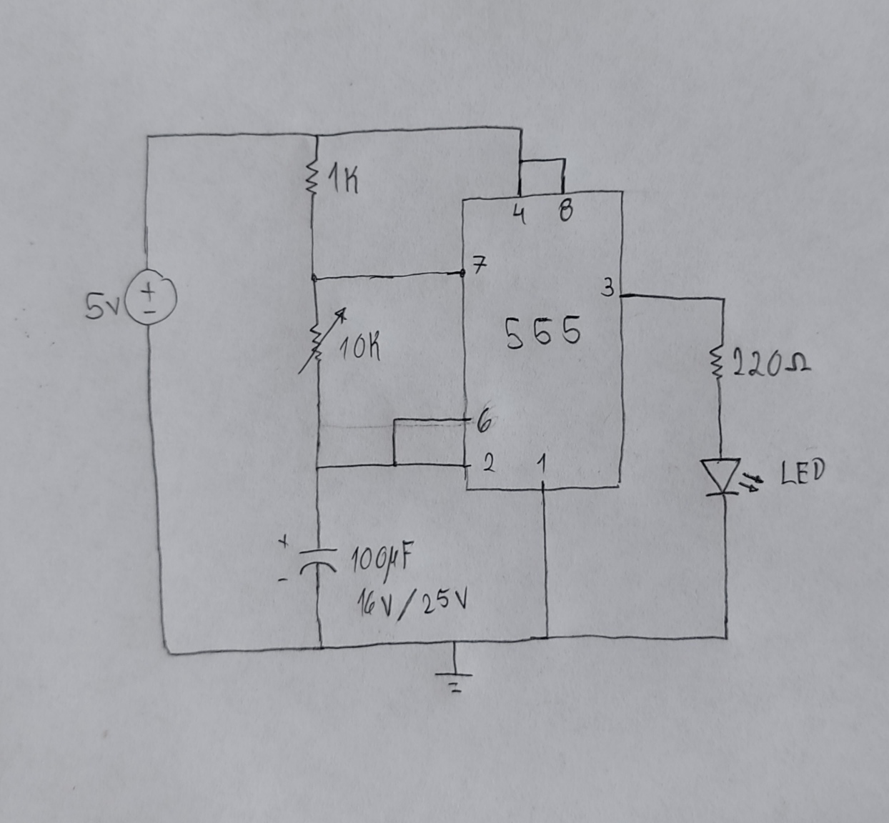
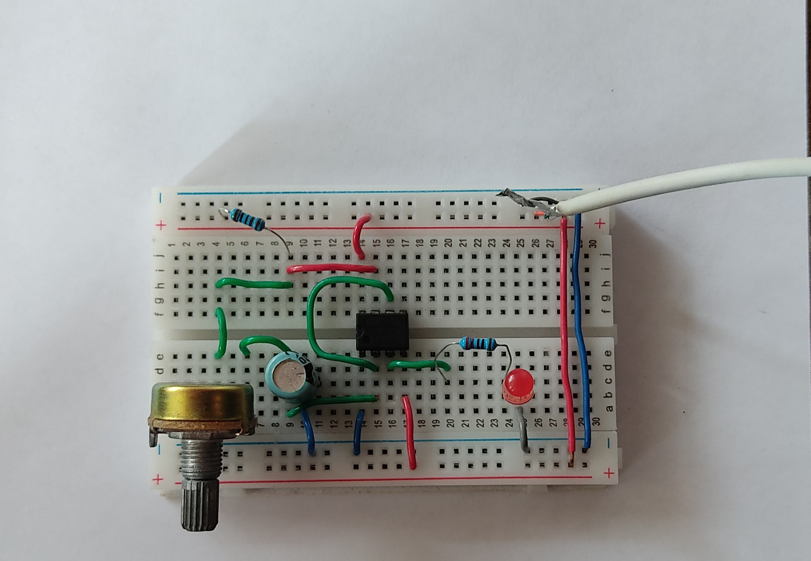

# Circuito-Temporizador-Astable-con-555
Circuito multivibrador astable con el circuito integrado 555.
El potenciómetro permite regular la velocidad del encendido y apagado del LED.

## Componentes
- 1 NE555.
- 1 Capacitor electrolítico de 100uf/16v o 25v.
- 1 resistencia de 1kΩ.
- 1 resistencia de 220Ω.
- 1 Potenciómetro de 10kΩ.
- 1 diodo LED.
- Protoboard.
- Ffuente DC de 5v

## Diagrama

## Circuito final
Para ver la demostración, hacer click en la imagen de abajo.

